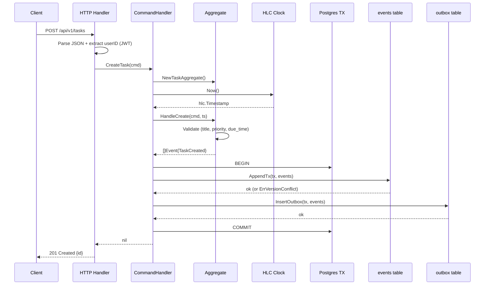

# Write Path — Online (HTTP)

How a command from the REST API becomes an event in the store and eventually updates the read model.

**Key invariants:**
- Events and outbox rows are written in a single Postgres transaction (no dual-write)
- The HLC clock provides causal ordering — never `time.Now()` directly
- Aggregate validates all business rules before producing events
- Response is immediate — projections happen asynchronously via workers
