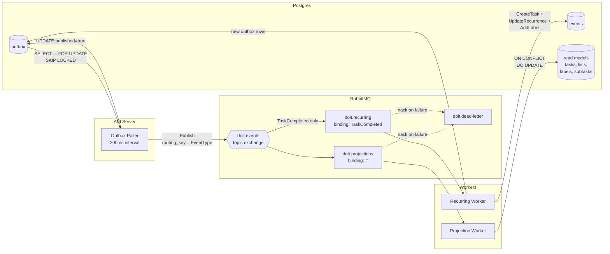
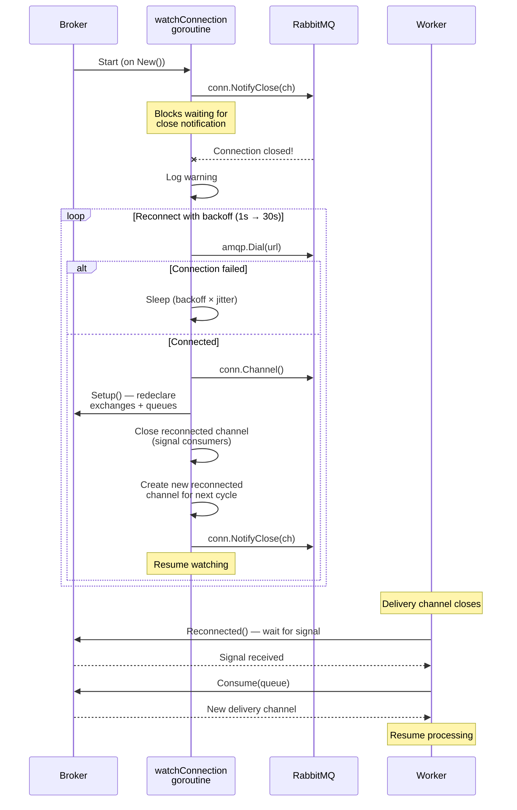

# Async Pipeline — Outbox → RabbitMQ → Workers → Read Models

How events flow from the outbox through RabbitMQ to projection and recurring workers.

**Key points:**
- Outbox poller uses `FOR UPDATE SKIP LOCKED` for safe concurrent polling
- Topic exchange routes by event type — projections get all events, recurring only gets `TaskCompleted`
- Projection worker is idempotent — all handlers use `ON CONFLICT DO UPDATE`
- Recurring worker creates new events (which cycle back through the same pipeline)
- Failed messages go to the dead-letter queue for manual inspection

---

## RabbitMQ Reconnection Flow

What happens when the broker connection drops (e.g., RabbitMQ restart, network hiccup).

**Key points:**
- `watchConnection()` goroutine runs for the broker's lifetime
- Uses `NotifyClose` callback — no polling, instant detection
- Exponential backoff: 1s base, 30s max, with 75-125% jitter
- After reconnect, `Setup()` redeclares exchanges and queues (idempotent)
- Workers detect reconnection via `Reconnected()` channel and re-subscribe
- All access to conn/channel protected by `sync.RWMutex`
