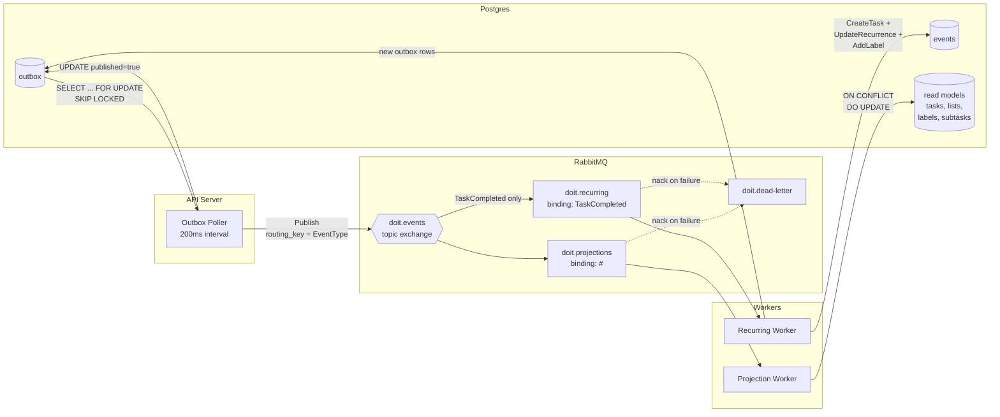

# Async Pipeline — Outbox → RabbitMQ → Workers → Read Models

How events flow from the outbox through RabbitMQ to projection and recurring workers.

**Key points:**
- Outbox poller uses `FOR UPDATE SKIP LOCKED` for safe concurrent polling
- Topic exchange routes by event type — projections get all events, recurring only gets `TaskCompleted`
- Projection worker is idempotent — all handlers use `ON CONFLICT DO UPDATE`
- Recurring worker creates new events (which cycle back through the same pipeline)
- Failed messages go to the dead-letter queue for manual inspection
