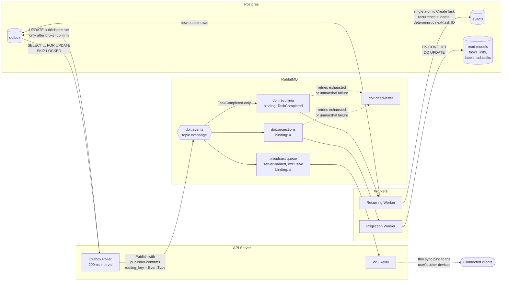
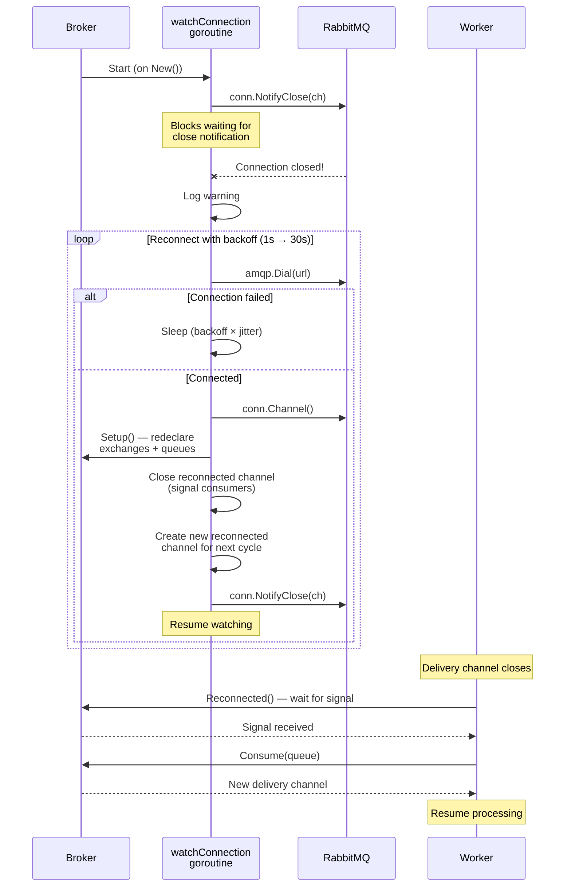

# Async Pipeline — Outbox → RabbitMQ → Workers → Read Models

How events flow from the outbox through RabbitMQ to projection and recurring workers.

```mermaid
flowchart LR
    subgraph Postgres
        OB[(outbox)]
        ES[(events)]
        RM[(read models<br/>tasks, lists,<br/>labels, subtasks)]
    end

    subgraph API Server
        Poller[Outbox Poller<br/>200ms interval]
        Relay[WS Relay]
    end

    subgraph RabbitMQ
        EX{{doit.events<br/>topic exchange}}
        QP[doit.projections<br/>binding: #]
        QR[doit.recurring<br/>binding: TaskCompleted]
        QB[broadcast queue<br/>server-named, exclusive<br/>binding: #]
        DLQ[doit.dead-letter]
    end

    subgraph Workers
        PW[Projection Worker]
        RW[Recurring Worker]
    end

    OB -->|SELECT ... FOR UPDATE<br/>SKIP LOCKED| Poller
    Poller -->|Publish with<br/>publisher confirms<br/>routing_key = EventType| EX
    Poller -->|UPDATE published=true<br/>only after broker confirm| OB
    EX --> QP
    EX -->|TaskCompleted only| QR
    EX --> QB
    QP --> PW
    QR --> RW
    QB --> Relay
    Relay -.->|"thin sync ping to the<br/>user's other devices"| Devices([Connected clients])
    PW -->|ON CONFLICT<br/>DO UPDATE| RM
    RW -->|single atomic CreateTask<br/>recurrence + labels,<br/>deterministic next-task ID| ES
    RW -->|new outbox rows| OB
    QP -.->|retries exhausted<br/>or unmarshal failure| DLQ
    QR -.->|retries exhausted<br/>or unmarshal failure| DLQ
```

**Key points:**
- Outbox poller uses `FOR UPDATE SKIP LOCKED` for safe concurrent polling
- Publishing uses publisher confirms (`RABBITMQ_PUBLISH_TIMEOUT`) — rows are marked published only after the broker confirms receipt
- Topic exchange routes by event type — projections get all events, recurring only gets `TaskCompleted`; a server-named exclusive queue feeds the WS relay (ADR-012)
- Projection worker is idempotent — all handlers use `ON CONFLICT DO UPDATE` — and retries failures (`PROJECTION_RETRY_MAX` × `PROJECTION_RETRY_DELAY`); only exhausted retries dead-letter (unmarshal failures dead-letter immediately)
- Recurring worker emits one atomic `CreateTask` event batch carrying the recurrence rule and labels, with a deterministic next-task ID derived from the completing event — safe under redelivery
- Dead-lettered messages are kept for manual inspection

---

## RabbitMQ Reconnection Flow

What happens when the broker connection drops (e.g., RabbitMQ restart, network hiccup).

```mermaid
sequenceDiagram
    participant B as Broker
    participant WG as watchConnection<br/>goroutine
    participant RMQ as RabbitMQ
    participant W as Worker

    B->>WG: Start (on New())
    WG->>RMQ: conn.NotifyClose(ch)
    Note over WG: Blocks waiting for<br/>close notification

    RMQ--xWG: Connection closed!
    WG->>WG: Log warning

    loop Reconnect with backoff (1s → 30s)
        WG->>RMQ: amqp.Dial(url)
        alt Connection failed
            WG->>WG: Sleep (backoff × jitter)
        else Connected
            WG->>RMQ: conn.Channel()
            WG->>B: Setup() — redeclare<br/>exchanges + queues
            WG->>WG: Close reconnected channel<br/>(signal consumers)
            WG->>WG: Create new reconnected<br/>channel for next cycle
            WG->>RMQ: conn.NotifyClose(ch)
            Note over WG: Resume watching
        end
    end

    Note over W: Delivery channel closes
    W->>B: Reconnected() — wait for signal
    B-->>W: Signal received
    W->>B: Consume(queue)
    B-->>W: New delivery channel
    Note over W: Resume processing
```

**Key points:**
- `watchConnection()` goroutine runs for the broker's lifetime
- Uses `NotifyClose` callback — no polling, instant detection
- Exponential backoff: 1s base, 30s max, with 75-125% jitter
- After reconnect, `Setup()` redeclares exchanges and queues (idempotent)
- Workers detect reconnection via `Reconnected()` channel and re-subscribe
- All access to conn/channel protected by `sync.RWMutex`
