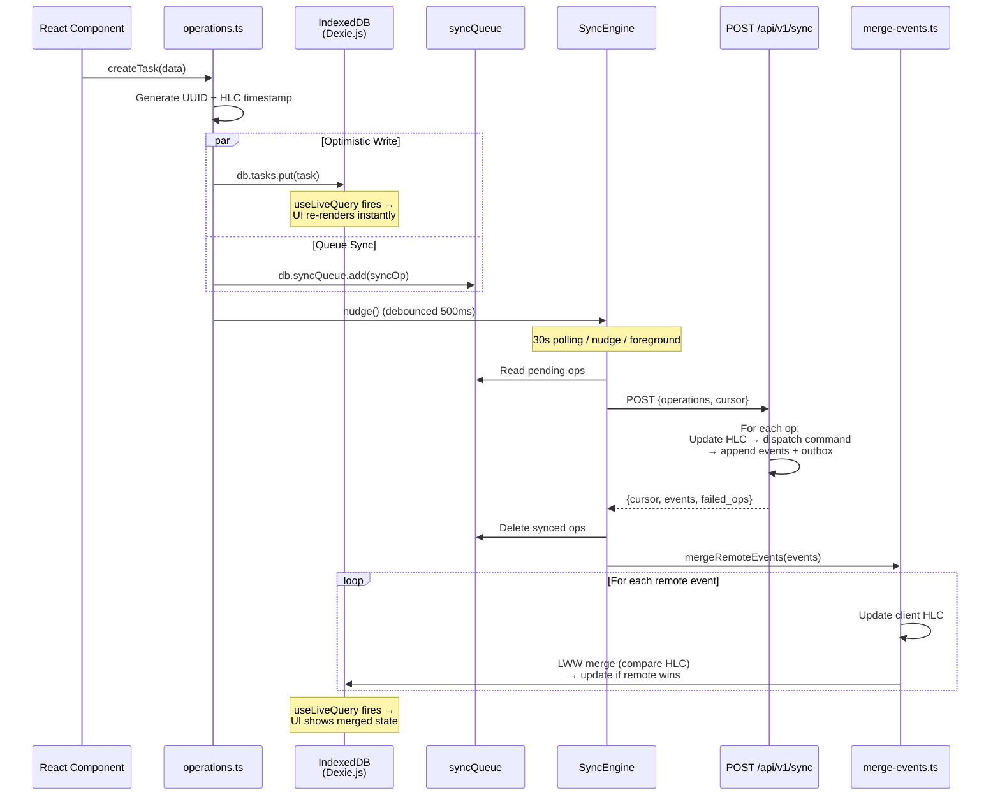

# Offline-First Sync — Client ↔ Server

How writes happen locally first and sync to the server in the background.

**Key points:**
- Writes are **instant** — IndexedDB updated before network call
- Sync engine retries with exponential backoff (5s → 10s → ... → 5min)
- Server returns new events from other devices — merged via LWW-Register
- No rollback on sync failure — operations stay in queue and retry
- Client HLC is updated from remote events to maintain causal ordering
