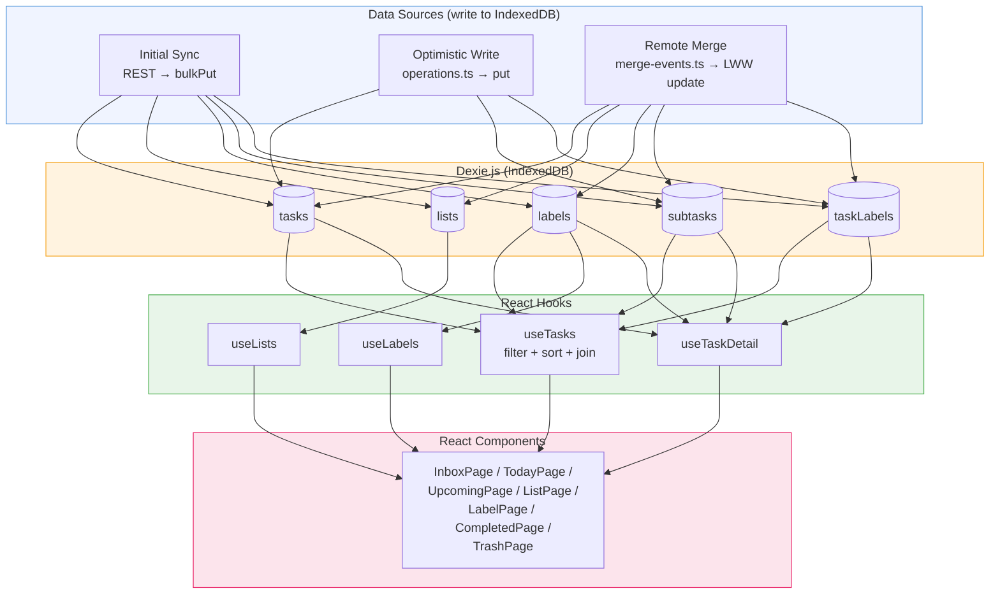

# Read Path — IndexedDB → useLiveQuery → React

How data flows from local storage to the UI. All reads come from IndexedDB — never from the API.

**Key points:**
- `useLiveQuery` auto-re-renders components when IndexedDB data changes
- No state management libraries (Redux, Zustand, etc.) — Dexie is the sole state layer
- Hooks compose data: `useTasks` joins tasks + subtasks + labels in one query
- Three sources write to IndexedDB: initial sync, local writes, and remote merges
