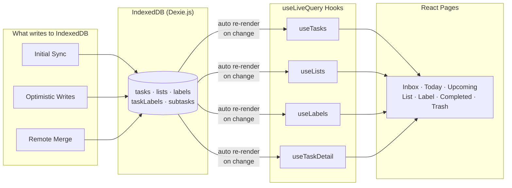

# Read Path — IndexedDB → useLiveQuery → React

How data flows from local storage to the UI. All reads come from IndexedDB — never from the API.

## What each hook queries

| Hook | Tables | What it does |
|------|--------|-------------|
| `useTasks` | tasks + taskLabels + subtasks + labels | Filters by list/label/status, sorts by position, joins subtasks and labels |
| `useLists` | lists | All user lists, sorted by position |
| `useLabels` | labels | All user labels |
| `useTaskDetail` | tasks + subtasks + taskLabels + labels | Single task with full subtask and label data |

**Key points:**
- `useLiveQuery` auto-re-renders components when IndexedDB data changes
- No state management libraries (Redux, Zustand, etc.) — Dexie is the sole state layer
- Three sources write to IndexedDB: initial sync, local optimistic writes, and remote event merges
