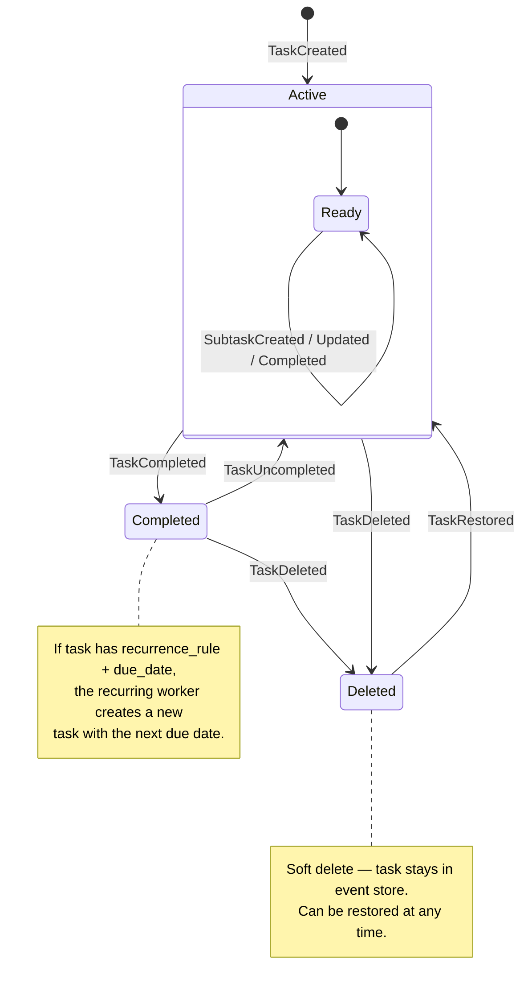
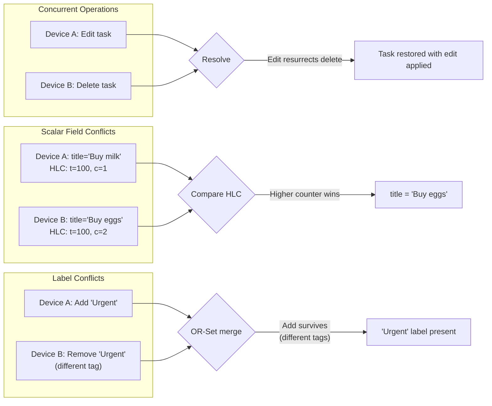
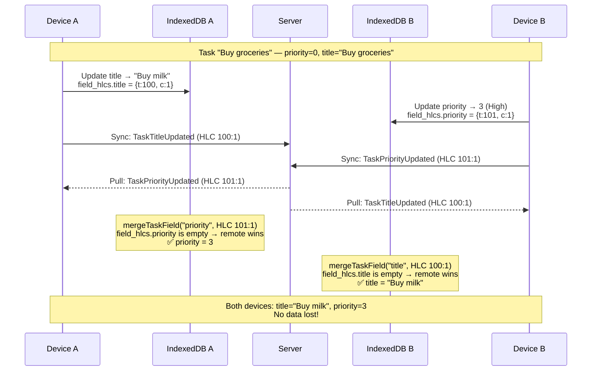
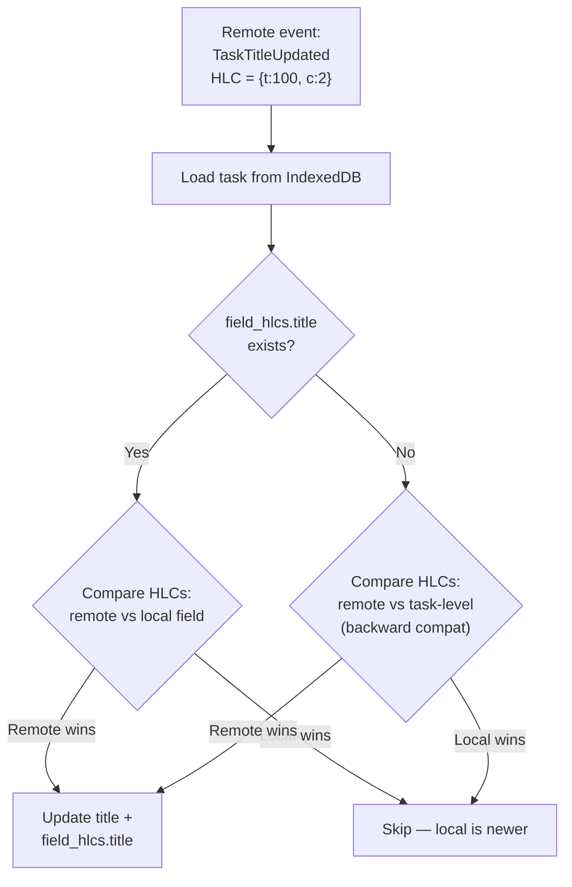

# Task Lifecycle — State Machine

Valid states and transitions for a task aggregate.

## Conflict Resolution Policies

**Policies:**
- **Edit vs Delete** → edit wins (task restored)
- **Complete vs Delete** → complete wins (task restored as completed)
- **Concurrent scalar edits** → Last-Writer-Wins by per-field HLC timestamp
- **Concurrent label add/remove** → OR-Set semantics (add survives if different operation tags)
- **Concurrent list moves** → LWW by HLC timestamp

---

## Per-Field HLC Merge

How concurrent edits to **different fields** on different devices are both preserved.

**Key points:**
- Each field has its own HLC timestamp in `field_hlcs` map
- Concurrent edits to **different** fields are both preserved (no conflict)
- Concurrent edits to the **same** field → LWW (higher HLC wins, other is lost)
- Backward compatible: tasks without `field_hlcs` fall back to task-level HLC
- `TaskCreated` initializes all field HLCs to the creation event's HLC
