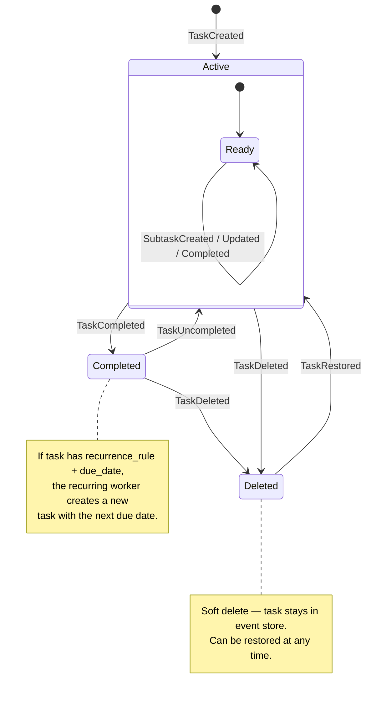
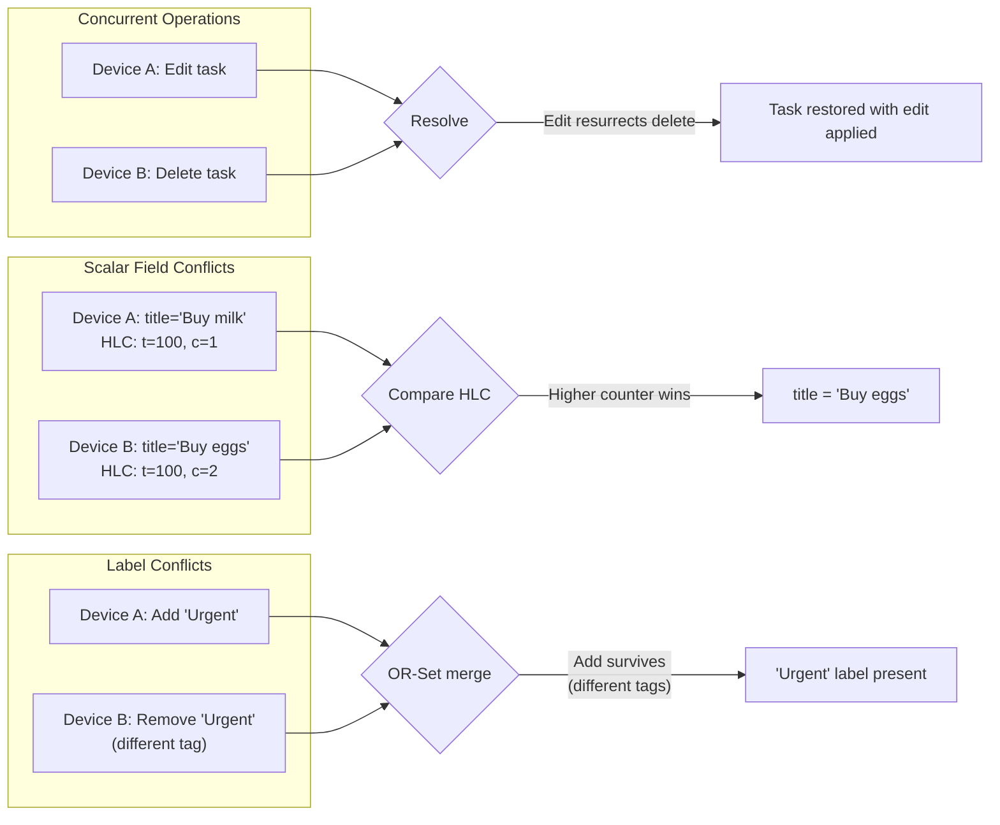

# Task Lifecycle — State Machine

Valid states and transitions for a task aggregate.

## Conflict Resolution Policies

**Policies:**
- **Edit vs Delete** → edit wins (task restored)
- **Complete vs Delete** → complete wins (task restored as completed)
- **Concurrent scalar edits** → Last-Writer-Wins by HLC timestamp
- **Concurrent label add/remove** → OR-Set semantics (add survives if different operation tags)
- **Concurrent list moves** → LWW by HLC timestamp
