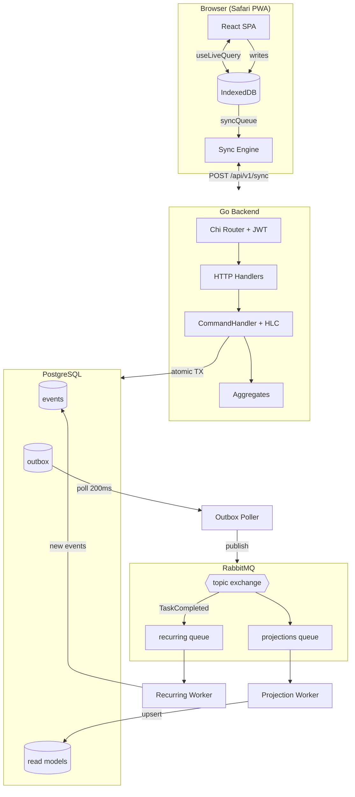
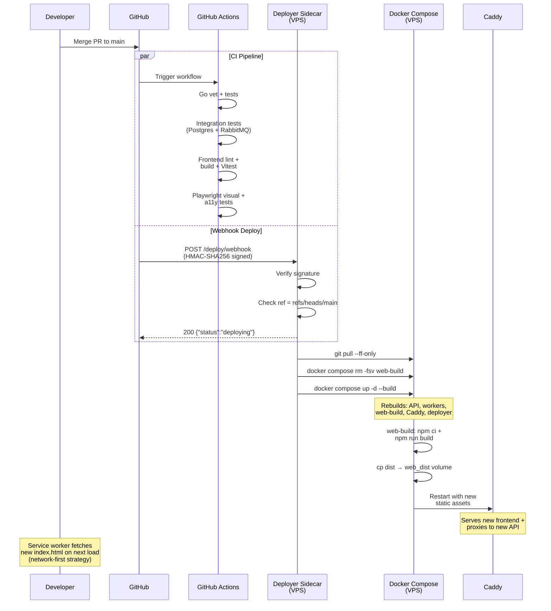
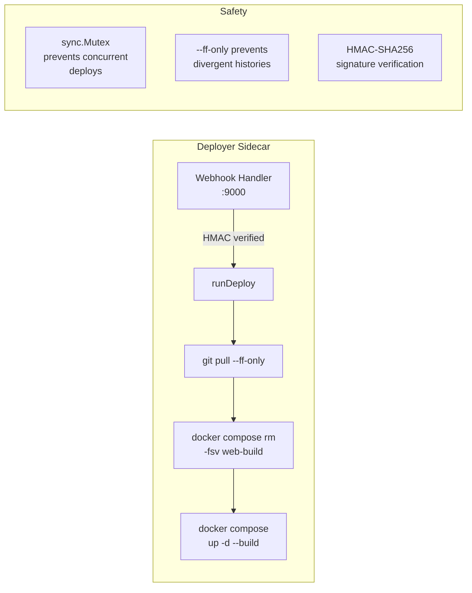

# System Overview — Full Architecture

High-level view of all components and how they connect.

**Component responsibilities:**

| Component | Role |
|-----------|------|
| **React SPA** | UI rendering, all reads from IndexedDB via `useLiveQuery` |
| **IndexedDB (Dexie.js)** | Client-side source of truth, drives UI reactivity |
| **Sync Engine** | Background push/pull — batches ops to `/api/v1/sync` every 30s |
| **CommandHandler** | Loads aggregate, validates via HLC clock, atomic event + outbox write |
| **Outbox Poller** | Polls every 200ms, publishes to RabbitMQ, marks as published |
| **Projection Worker** | Consumes all events, upserts into read model tables (idempotent) |
| **Recurring Worker** | Consumes `TaskCompleted`, creates next occurrence if recurring |
| **Rebuild CLI** | Disaster recovery — replays full event log to reconstruct read models |

**Data flow summary:**
1. Client writes to IndexedDB instantly, queues sync op
2. Sync engine pushes ops to server, pulls remote events back
3. Server validates commands, writes events + outbox atomically
4. Poller publishes outbox to RabbitMQ
5. Workers consume and update read models / create recurring tasks

---

## Deployment Flow — Push to Production

What happens when code is merged to main.

**Key points:**
- CI and deploy run in parallel — deploy doesn't wait for CI
- Deployer uses `TryLock` mutex to prevent concurrent deploys
- `web-build` one-shot container must be removed before rebuild (Docker skips completed containers)
- Service worker uses network-first for `index.html` so deploys take effect on next page load
- Deployer rebuilds itself as part of `docker compose up` — chicken-and-egg on deployer code changes requires manual `docker compose up -d --build deployer`
- `git pull --ff-only` prevents accidental force-pushes from corrupting the deploy
