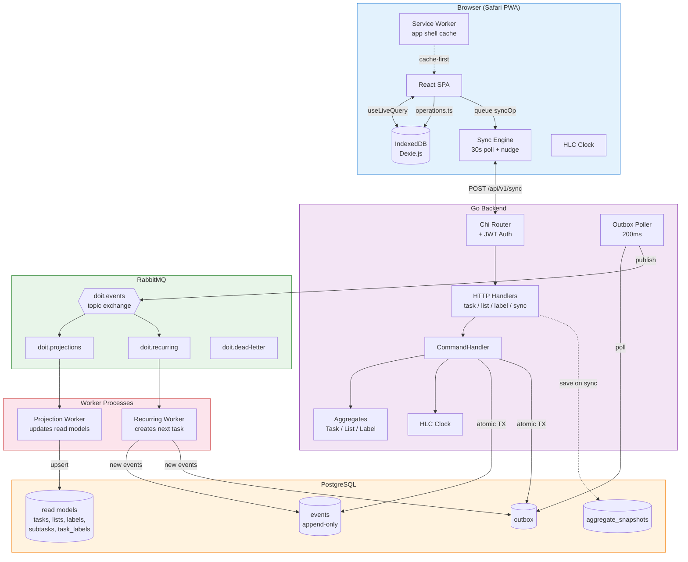

# System Overview — Full Architecture

High-level view of all components and how they connect.

**Component responsibilities:**
| Component | Role |
|-----------|------|
| **React SPA** | UI rendering, user interaction, all reads from IndexedDB |
| **Dexie.js / IndexedDB** | Client-side source of truth, live queries drive UI |
| **Sync Engine** | Background push/pull of operations to/from server |
| **Service Worker** | App shell caching for offline launch |
| **HTTP Handlers** | Request parsing, routing to CommandHandler |
| **CommandHandler** | Aggregate loading, HLC timestamping, transactional append |
| **Aggregates** | Business rule validation, event production |
| **Outbox Poller** | Reliable event publishing (no message loss) |
| **RabbitMQ** | Event routing to workers via topic exchange |
| **Projection Worker** | Async read model updates (idempotent) |
| **Recurring Worker** | Creates next task occurrence on completion |
| **Rebuild CLI** | Disaster recovery — replays event log to reconstruct read models |
