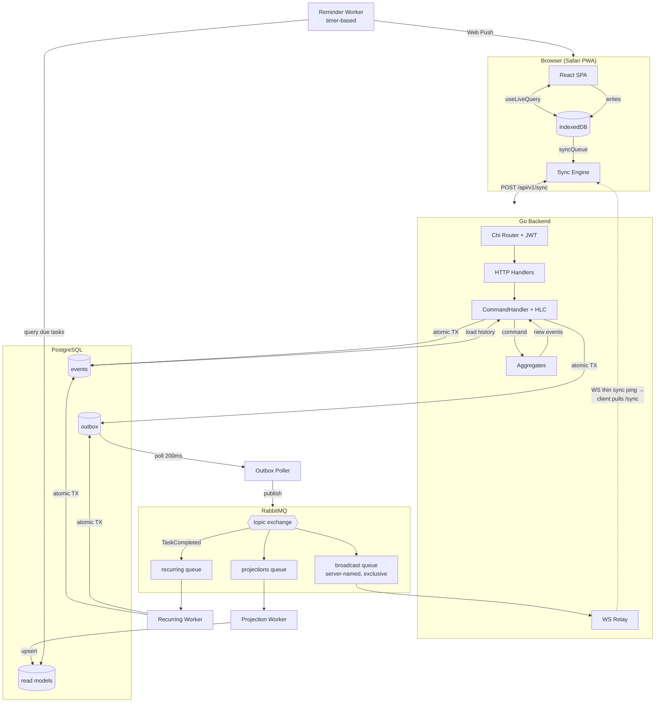
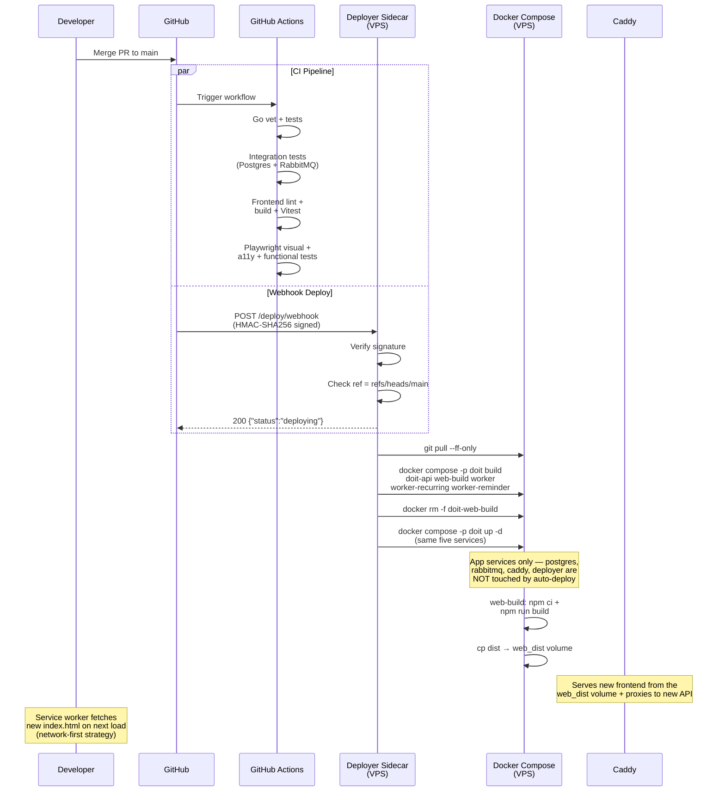
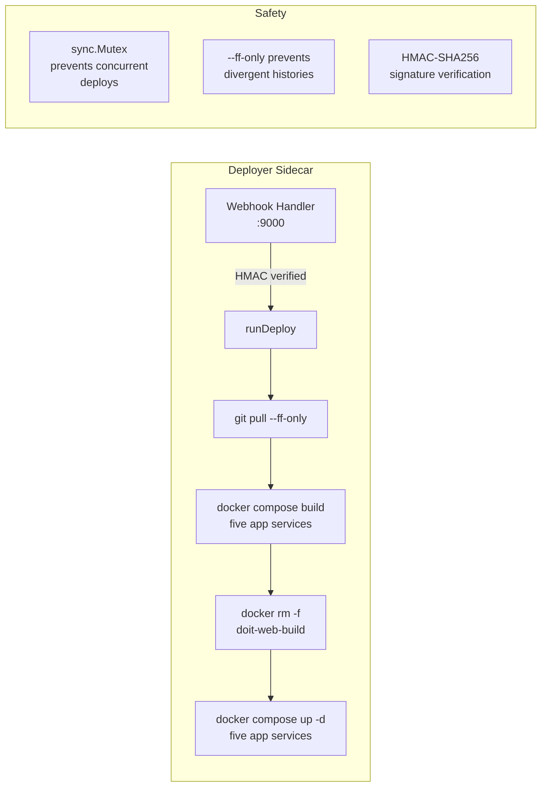

# System Overview — Full Architecture

High-level view of all components and how they connect.

```mermaid
flowchart TB
    subgraph Client["Browser (Safari PWA)"]
        direction LR
        React[React SPA] <-->|useLiveQuery| IDB[(IndexedDB)]
        React -->|writes| IDB
        IDB -->|syncQueue| SE[Sync Engine]
    end

    SE <-->|"POST /api/v1/sync"| Server

    subgraph Server["Go Backend"]
        direction LR
        Router[Chi Router + JWT] --> Handlers[HTTP Handlers]
        Handlers --> CMD[CommandHandler + HLC]
        CMD -->|command| Agg[Aggregates]
        Agg -->|new events| CMD
        Relay[WS Relay]
    end

    Relay -.->|"WS thin sync ping →<br/>client pulls /sync"| SE

    Events -->|"load history"| CMD
    CMD -->|"atomic TX"| Events
    CMD -->|"atomic TX"| Outbox

    subgraph PG["PostgreSQL"]
        direction LR
        Events[(events)] ~~~ Outbox[(outbox)] ~~~ RM[(read models)]
    end

    Outbox -->|"poll 200ms"| Poller[Outbox Poller]
    Poller -->|publish| MQ

    subgraph MQ["RabbitMQ"]
        direction LR
        Exchange{{topic exchange}} --> ProjQ[projections queue]
        Exchange -->|TaskCompleted| RecQ[recurring queue]
        Exchange --> BcastQ[broadcast queue<br/>server-named, exclusive]
    end

    ProjQ --> ProjW[Projection Worker]
    RecQ --> RecW[Recurring Worker]
    BcastQ --> Relay

    ProjW -->|upsert| RM
    RecW -->|"atomic TX"| Events
    RecW -->|"atomic TX"| Outbox

    ReminderW[Reminder Worker<br/>timer-based] -->|query due tasks| RM
    ReminderW -->|Web Push| Client
```

**Component responsibilities:**

| Component | Role |
|-----------|------|
| **React SPA** | UI rendering, all reads from IndexedDB via `useLiveQuery` |
| **IndexedDB (Dexie.js)** | Client-side source of truth, drives UI reactivity |
| **Sync Engine** | Background push/pull — batches ops to `/api/v1/sync` every 30s |
| **CommandHandler** | Loads aggregate, validates via HLC clock, atomic event + outbox write |
| **Outbox Poller** | Polls every 200ms, publishes to RabbitMQ with confirms, marks as published |
| **WS Relay** | Consumes the broadcast queue, sends thin `{"type":"sync"}` pings to the user's other connected devices (ADR-012) |
| **Projection Worker** | Consumes all events, upserts into read model tables (idempotent) |
| **Recurring Worker** | Consumes `TaskCompleted`, creates next occurrence if recurring |
| **Reminder Worker** | Timer-based (not RabbitMQ) — queries read models for due tasks, sends Web Push notifications |
| **Rebuild CLI** | Disaster recovery — replays full event log to reconstruct read models |

**Data flow summary:**
1. Client writes to IndexedDB instantly, queues sync op
2. Sync engine pushes ops to server, pulls remote events back
3. Server validates commands, writes events + outbox atomically
4. Poller publishes outbox to RabbitMQ
5. Workers consume and update read models / create recurring tasks
6. The WS relay pings the user's other devices, which react with their own `/sync` pull

---

## Deployment Flow — Push to Production

What happens when code is merged to main.

```mermaid
sequenceDiagram
    participant Dev as Developer
    participant GH as GitHub
    participant CI as GitHub Actions
    participant WH as Deployer Sidecar<br/>(VPS)
    participant DC as Docker Compose<br/>(VPS)
    participant Caddy as Caddy

    Dev->>GH: Merge PR to main

    par CI Pipeline
        GH->>CI: Trigger workflow
        CI->>CI: Go vet + tests
        CI->>CI: Integration tests<br/>(Postgres + RabbitMQ)
        CI->>CI: Frontend lint +<br/>build + Vitest
        CI->>CI: Playwright visual +<br/>a11y + functional tests
    and Webhook Deploy
        GH->>WH: POST /deploy/webhook<br/>(HMAC-SHA256 signed)
        WH->>WH: Verify signature
        WH->>WH: Check ref = refs/heads/main
        WH-->>GH: 200 {"status":"deploying"}
    end

    WH->>DC: git pull --ff-only
    WH->>DC: docker compose -p doit build<br/>doit-api web-build worker<br/>worker-recurring worker-reminder
    WH->>DC: docker rm -f doit-web-build
    WH->>DC: docker compose -p doit up -d<br/>(same five services)

    Note over DC: App services only — postgres,<br/>rabbitmq, caddy, deployer are<br/>NOT touched by auto-deploy

    DC->>DC: web-build: npm ci +<br/>npm run build
    DC->>DC: cp dist → web_dist volume

    Note over Caddy: Serves new frontend from the<br/>web_dist volume + proxies to new API

    Note over Dev: Service worker fetches<br/>new index.html on next load<br/>(network-first strategy)
```

```mermaid
flowchart LR
    subgraph "Deployer Sidecar"
        WH[Webhook Handler<br/>:9000] -->|HMAC verified| Deploy[runDeploy]
        Deploy --> Pull[git pull --ff-only]
        Pull --> Build[docker compose build<br/>five app services]
        Build --> RM[docker rm -f<br/>doit-web-build]
        RM --> Up[docker compose up -d<br/>five app services]
    end

    subgraph "Safety"
        Mutex[sync.Mutex<br/>prevents concurrent<br/>deploys]
        FFOnly[--ff-only prevents<br/>divergent histories]
        HMAC[HMAC-SHA256<br/>signature verification]
    end
```

**Key points:**
- CI and deploy run in parallel — deploy doesn't wait for CI
- Deployer uses `TryLock` mutex to prevent concurrent deploys
- `doit-web-build` one-shot container removed via `docker rm -f` before rebuild (Docker skips completed containers)
- Service worker uses network-first for `index.html` so deploys take effect on next page load
- Auto-deploy covers only the five app services (doit-api, web-build, worker, worker-recurring, worker-reminder). Changes to the Caddyfile, compose infra stanzas, or the deployer itself need a manual `docker compose up -d --build` on the host
- If `DEPLOY_WEBHOOK_SECRET` is unset the deployer idles (webhook returns 503) instead of deploying
- `git pull --ff-only` prevents accidental force-pushes from corrupting the deploy
