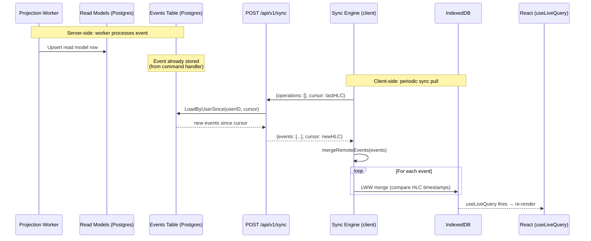

# Data Loop — How Server Changes Reach the Client

How events produced on the server (by workers or other devices) flow back to the client's IndexedDB.

## Two paths to the client

| Path | When | Source | Used for |
|------|------|--------|----------|
| **Initial sync** | First app load (no cursor) | `GET /api/v1/tasks` → read models | Bootstrapping IndexedDB with full state |
| **Incremental sync** | Every 30s + on foreground | `POST /api/v1/sync` → events table | Pulling new events from other devices / workers |

**Key insight:** After the initial load, the client never reads from the Postgres read models again. It stays in sync through the **events table** — the same immutable log that is the source of truth for everything. The read models exist for the REST API and initial sync only.
